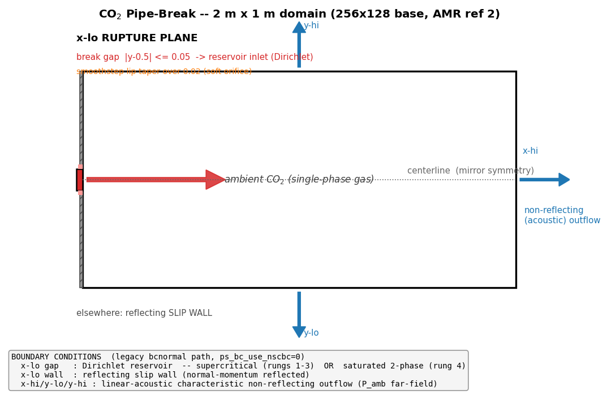
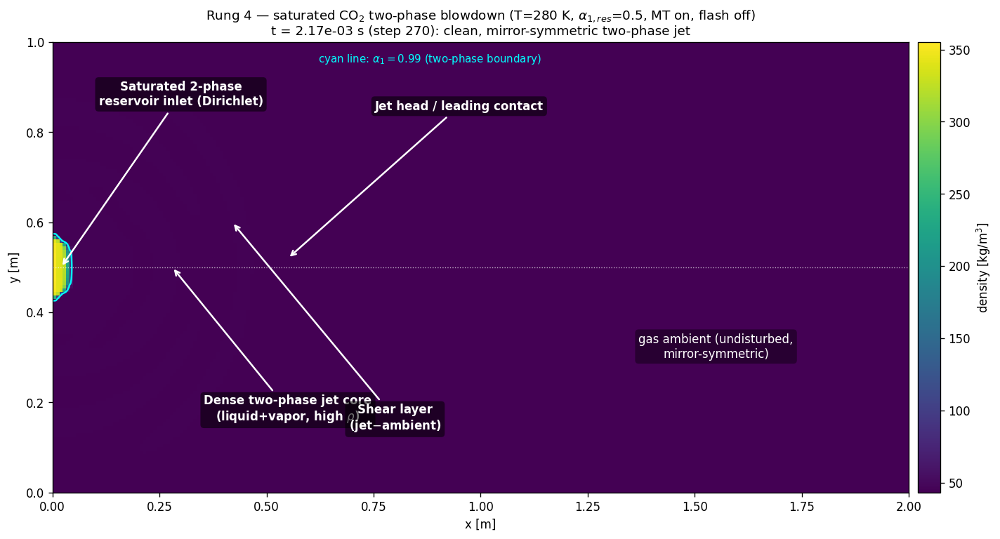

# A verified 2-D baseline for the CAMR Pelanti–Shyue CO₂ pipe-break

**Status:** clean, symmetric, long-time 2-D evolutions established for single-phase
and genuine two-phase regimes. Flash (nucleation) physics is deliberately **held
out** for the next stage. This note documents the configuration, the incremental
verification ladder, and the one remaining ingredient.

---

## 1. Motivation

The target application is a compressible two-phase CO₂ release (a "pipe-break"
blowdown) solved with the six-equation Pelanti–Shyue (PS) model on the CAMR/AMReX
adaptive-mesh framework, using a Berger–LeVeque **wave-propagation** (`ps_flux=wp`)
face solver with a Peng–Robinson real-fluid EOS. Earlier attempts to run the full
flashing configuration (dense liquid vented into gas across the saturation dome)
developed rapidly growing noise/asymmetry and eventually failed. This note isolates
*which* physics is responsible and establishes a trustworthy baseline by turning on
one ingredient at a time and verifying that each preserves a clean, mirror-symmetric,
long-time solution before the next is added.

The governing invariant we enforce throughout: **every per-cell operator must be a
continuous function of state**, so that round-off-level "chatter" stays at round-off
and cannot be amplified into asymmetry or nonphysical states. This is essential for
the downstream production cases, which will contain genuine noise.

---

## 2. Configuration



A 2 m × 1 m rectangular domain (256×128 base cells; AMR refinement ratio 2). The
`x`-lo face is the **rupture plane**, realised entirely in `bcnormal` (legacy path,
`CAMR.ps_bc_use_nscbc=0`):

| segment | boundary condition |
|---|---|
| `x`-lo break gap, \|y−0.5\| ≤ 0.05 | **Dirichlet reservoir inlet** (soft-orifice, smoothstep lip taper over 0.02 m) |
| `x`-lo elsewhere | **reflecting slip wall** (normal momentum reflected) |
| `x`-hi, `y`-lo, `y`-hi | **linear-acoustic characteristic non-reflecting outflow** (far-field `p_amb`) |

The setup is symmetric about the centerline `y = 0.5` (which lies exactly on a cell
face for `n_cell_y = 128`), so **exact mirror symmetry is the correctness diagnostic**:
any departure of the conserved fields from `f(y) = f(1−y)` above round-off signals an
asymmetric numerical operator.

Numerics common to all cases: `ps_flux=wp` (wave-propagation, 2nd order via limited
BL correction fluxes), `ps_recon=0` (piecewise-constant reconstruction — required for
the reservoir-ghost injection), single-step unsplit advance (`do_mol=0`), CFL 0.3,
continuous positivity floors on `P` and `T`, mechanical pressure relaxation on.

---

## 3. Verification ladder

Each rung turns on one additional ingredient and is validated for symmetry
(max\|ρ(y)−ρ(1−y)\|), boundedness (min P, min/max ρ, min T), and absence of NaN over
a **long** time integration. All runs are round-off symmetric.

| rung | ingredient added | case | result |
|---|---|---|---|
| 1 | single-phase supercritical jet, single level | `inputs.scjet` (T=400 K, 2:1) | 520 steps / 3.0 ms; asym ρ ≤ 5×10⁻¹⁰; quasi-steady |
| 2 | AMR (1 then 2 refinement levels) | `inputs.scjet`, `max_level=1,2` | symmetric with refinement active; C-F reflux/regrid clean |
| 3 | strong under-expansion (to 16:1) | `inputs.scjet`, T=600 K, `p_res` swept | symmetric barrel-shock / Mach-disk; 8:1 durable to 270 steps |
| 4 | **genuine two-phase** (mass transfer) | `inputs.satjet` (saturated blowdown) | 270 steps / 2.2 ms; asym ρ ~4×10⁻¹¹ (bounded); ~90 two-phase cells |

Key points:

- **Rungs 1–3 (single phase).** To keep the fluid single-phase while raising the
  vent strength, the temperature is held above the critical temperature (400 K,
  then 600 K > T_crit = 304 K) so that an expansion cannot cross the saturation
  dome. The wave-propagation scheme resolves a clean barrel-shock/Mach-disk
  structure at 8:1–16:1 under-expansion while remaining exactly mirror-symmetric,
  confirming the multi-dimensional hydrodynamics, transverse coupling, boundary
  injection, and AMR coarse-fine machinery are all symmetry-clean.

- **Rung 4 (two-phase).** A new **saturated two-phase inlet** (`prob.res_alpha1`)
  injects an equilibrium liquid+vapor mixture (`EOS::co2_sat_LV` at `T_res`), so
  genuine two-phase cells enter the domain from the boundary and exercise the mass
  transfer and mechanical relaxation on real coexistence — **without** flash
  nucleation. The result is a clean, symmetric, long-time two-phase blowdown
  (below). This establishes that mass transfer + relaxation are well-behaved on
  two-phase cells; they are not the source of the earlier failures.



---

## 4. What is held out for the next step

**Flash (nucleation) is deliberately disabled** (`ps_flash_tau = 0`) in every rung
above. The reason is the central diagnostic result of this work:

> In an Eulerian sharp-interface setting, **flash is the nucleation mechanism** that
> converts a metastable single-phase state into two phases. Without it, a metastable
> cell simply stays single-phase; with it, two-phase cells are *created* wherever the
> local state is metastable.

The flashing configuration places a metastable region exactly at the venting orifice
lip — which is a strong hydrodynamic **amplifier** (an under-expanded jet lip). Flash
there converts the lip to two-phase and the amplifier grows any perturbation, down to
round-off, into an O(1) asymmetry within a few time steps. Making the flash source a
*continuous* function of state (smooth activation windows in T, α, and the
metastability margin; a fractional-flash limiter replacing the all-or-nothing
EOS-validity rollback; finiteness-based gates that accept metastable P ≤ 0 branch
states) reduced the injected seed by ~10³ and delayed onset, but cannot by itself
defeat a few-step-e-folding amplifier.

Therefore the next stage (**rung 5**) re-introduces flash behind a **centerline
symmetry boundary condition** (half-domain), so nucleation physics can be developed
and verified against the symmetric baseline without the lip instability masking
correctness; and/or with explicit lip regularization. The deeper, fluid-agnostic
route is a better-conditioned EOS evaluation at the saturation dome (an MLP surrogate)
to remove the branch-locked validity discontinuity that the flash decisions inherit.

---

## 5. Reproduction

```
# Rung 1–2: single-phase supercritical jet (add amr.max_level=1 or 2 for rung 2)
./CAMR2d.gnu.<...>.ex inputs.scjet

# Rung 3: strong under-expansion (deep supercritical)
./CAMR2d.gnu.<...>.ex inputs.scjet prob.T0=600 prob.T_res=600 prob.p_res=8.0e6

# Rung 4: saturated two-phase blowdown (mass transfer on, flash off)
./CAMR2d.gnu.<...>.ex inputs.satjet
```

Supporting figures in this directory: `pipebreak_schematic.png` (configuration),
`scjet_montage.png` / `scjet_r8_structure.png` (single-phase rungs),
`satjet_montage.png` / `satjet_annotated.png` (two-phase rung).
